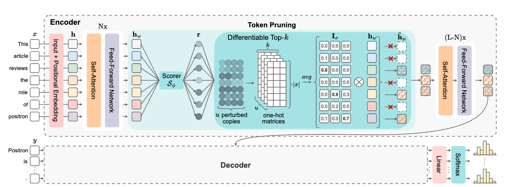
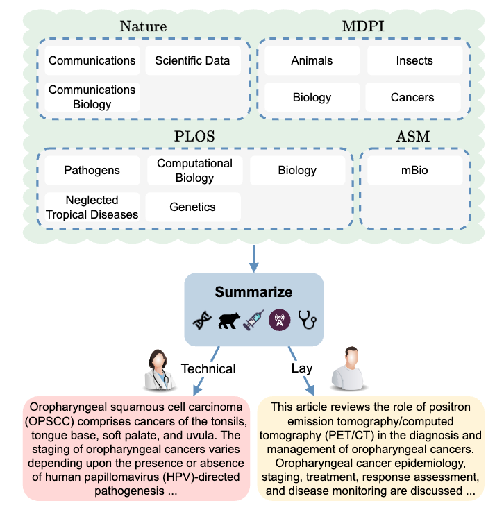

# What Are You Token About? Differentiable Perturbed Top-k Token Selection for Scientific Document Summarization

> **Abstract:** Scientific document summarization (SDS) aims to condense complex and long articles in both technical and plain-language terms to facilitate the accessibility and dissemination of scientific findings. Existing datasets suffer from a deficiency in source heterogeneity, as their data predominantly stem from a single common resource, hindering effective model training and generalizability. First, we introduce SciLay, a novel dataset that includes documents from multiple natural science journals with expert-authored technical and lay summaries. Second, we propose PrunePert, a new transformer-based model that incorporates a differentiable perturbed top-k encoder layer to prune irrelevant tokens in end-to-end learning. Experimental results show that our model achieves a nearly 2x speed-up compared to a state-of-the-art linear transformer, remaining comparable in effectiveness. Additional examinations underscore the importance of employing a training dataset that includes different sources to enhance the generalizability of the models.


## PrunePert

<p align="center">
  
</p>


### Getting Started
```
pip install -r requirements.txt
git clone https://github.com/neulab/BARTScore.git
```

### Pegasus + PrunePert Fine-tuning
```
CUDA_VISIBLE_DEVICES=0 python3 run_generation.py \
--logging online \
--run_name pegasus_hard_top50%_200n_0.2sigma_decr_layer3_all_technical_text \
--use_topk \
--decr_sigma \
--n_samples 200 \
--top_p 0.50 \
--sigma 0.2 \
--encoder_topk_layer 3 \
--topk_inference hard \
--do_train \
--do_predict \
--do_val \
--output_dir output_technical_text \
--dataset_name ccdv/arxiv-summarization \
--model_name_or_path ccdv/lsg-pegasus-large-4096 \
--log_level error \
--gradient_accumulation_steps 1 \
--max_target_length 512 \
--generation_max_length 512 \
--num_train_epochs 1 \
--learning_rate 5e-5 \
--save_strategy epoch \
--evaluation_strategy epoch \
--gradient_checkpointing \
--load_best_model_at_end \
--predict_with_generate \
--overwrite_cache \
--metric_for_best_model eval_rouge1 \
--save_total_limit 1 \
--group_by_length \
--sortish_sampler \
--weight_decay 0.01 \
--label_smoothing_factor 0.1 \
--include_inputs_for_metrics \
--remove_unused_columns \
--per_device_train_batch_size 1 \
--per_device_eval_batch_size 1 \
```

## SciLay

<p align="center">
  
</p>

SciLay is publicly available on HuggingFace: https://huggingface.co/datasets/disi-unibo-nlp/SciLay
